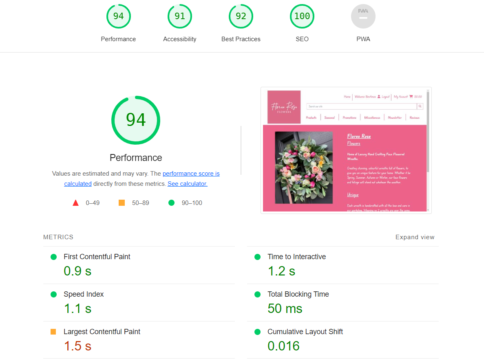

# Floree Rose Flowers

https://floree-rose.herokuapp.com/

# Purpose

To create a website that allows Floree Rose Flowers to showcase their products and allows the user to purchase an item if they desire. Allows Floree Rose Flowers CRUD functionality on all stock items, via front end access, as well as backend in the Admin panel. Give the user ability to select multiple items to a basket and then make a secure checkout once finished. User details are then stored for future purchases, and allows them to update their details as and when they like, also to show their order history. User can also leave a review on their overall service they have received and sign up to future newsletters that Floree Rose may send out.

[Facebook Mockup](/media/readme/Floree%20Rose%20Flower%20Facebook%20Mockup.bmpr)

Actual Facebook Page

https://www.facebook.com/floreeroseflowers/

[PP5 Planning](/media/readme/PP5-Planning.doc)

n.b. At time of development Floree Rose Flowers didn't have an active website, since during the development an active website has since been launched, which is why Facebook Mockups have been used.

## Create
Create instances of Stock, including all relevant data including images and category it belongs in, that is required for each item.
## Read
Pull this information, so that the end user can see the data linked to a particular item. Will be able to see the image, product name, description, price, rating and stock on hand
## Update
Allow the Floree Rose Flowers to edit the stock, i.e change image, update stock quantities, change description etc
## Delete
Allows the Floree Rose Flowers to delete stock that is no longer available, allowing them to keep their store up to date and ensure on fresh stock is on display.

# Database Schema

# Agile
Project has been worked through with User Stories in an Agile method. Using Github's projects, User issues were created to work through. These issues we given a story points (8, 6, 4 or 2), Stories were then split over iterations, with each iteration having a total of 20 story points. This allowed us to focus on the key stories to develop, show progress to the site owner through each iteration. Link to the project is below.

[User Stories](https://github.com/users/benamos216/projects/4)

# Wireframes
General mockup of how the site will look on both desktop and mobile. Using the colour scheme from the main logo as inspiration for the overall look of both displays. Trying to keep simple and clean, so an easy to navigate experience for the user. Desktop view will be able to display multiple items across the page, whereas mobile it will be stacked on top of one another.

## Desktop Wireframe
[Desktop Wireframe](/media/readme/Desktop-Mockup.bmpr)

## Mobile Wireframe
[Mobile Wireframe](/media/readme/Mobile-Mockup.bmpr)

# User Responsiveness

Image of how the site will look on different platforms, from Desktop to Mobile.

# Lighthouse Performance
Both desktop and mobile versions of the site have been passed through Chrome's Lighthouse to measure it's Performance, Accessability, Best Practices and SEO. This has been run several times, with improvements been made through the report generated, below are the current performance for the site.

# Validation
All page source HTML was passed through Nu HTML Validator to confirm all coding was up to standard. Only errorswarnings are for duplicated IDs that are used on mobile and desktop navigation. Along with stray footer tag, although there is a closing tag for the footer.

CSS code was also passed through a validator to make sure it conforms.

Furthermore, gitpods linter was used to ensure the backend coding followed industry standards, i.e no lines longer than 79 characters, correct spacing between classes/functions, blank spaces.

# Frameworks, Libraries & Dependancies

The following packages were used to create this project.

### Django 3.2
[Python web framework](https://www.djangoproject.com/)

### Psycopg 2
[Python PostgreSQL adapater](https://pypi.org/project/psycopg2/)

### Gunicorn
[Python WSGI HTTP server](https://gunicorn.org/)

### dj-database-url
[Django utility to create an environment variable to configure the Django application](https://pypi.org/project/dj-database-url/)

### Django-allauth
[User account management django application suite](https://django-allauth.readthedocs.io/en/latest/overview.html)

### Bootstrap 4.6.2
[Front end CSS and JavaScript library](https://getbootstrap.com/)

### Crispyforms 1.14
[Form rendering](https://pypi.org/project/django-crispy-forms/)

### Django-Storages 1.13.2
[Provide a variety of storage backends](https://pypi.org/project/django-storages/)

### mailchimp-marketing 3.0.80
[Mailchimp API](https://pypi.org/project/mailchimp-marketing/)

### Pillow 9.4
[Python Imaging Library](https://pypi.org/project/Pillow/)

### Stripe
[Stripe Payment Framework](https:stripe.com)

# Features

The main features of the site are as follows;

### User Signup / Login
Allows a new or existing user to signup or login. Signup requires email (to be re-entered to confirm), username and password (to be re-entered to confirm). On initial signup, a confirmation email is sent, with which the user has to verifiy that it was them that had signed up. Once verified, they are able to login with either email or username and password.

When signed in, top navbar will greet the user with their username, and have links to their account (profile and order history).

### Category Nav Search
Allows the user to search for items based upon a specific category. Within each title is a dropdown with sub categories that the user can choose from. When selected, any stock within the catergory will be displayed, showing the user the category selected and the number of items being returned.

### Search bar
Users can also search for an item, by typing into the search bar. This checks all items names and description for that word and returns all relevant items. Will inform the user the number of items that have been returned for that search citeria.

### Sort by ...
User can then further narrow down their search criteria, by sorting the items by either price, name, catergory or rating. This can be done by either assending or descending the sort criteria.

### Stock details
When a user selects an item, it will take them to a new page to show them all relevant information for that item. It will show them the image link to it, price, category, rating, qunatity available to purchase and description. They can then add this item to their basket if they desire, and will be able to adjust their required quantity up or down as needed. If the item is Out Of Stock, they will not be able to add it to their basket. When added to the basket, a message will appear to confirm it has been added, giving the user the chance to checkout from there. It will also update the cash figure on the navbar.

### Basket
Basket shows the user whats items they have in their basket to purchase, including the quantity, sub-total and overall grand total. The user can also adjust the quantity of each item within their basket, with the relevant totals updating once chosen.

### Checkout
Checkout page allows the user to input the delivery address that they wish the items to be delivered to. This can then be saved to the profile if they wish for future purchases. If details are added incorrectly or missing, the user will be notified to correct to proceed. The page also shows the user's basket for the final time, showing items, quantity, sub-total and grand total. Once delivery details are added, the user can then proceed to add their payment details. If the details aren't inputted correctly, the user is prompted with a message so they can correct. When their payment details are correctly entered, the user then selects complete order, where they are again told how much the card will be charged. Once payment has gone through, a message will be displayed confirming, with their order number and the email address the order confirmation has been sent to. The page will then redirect to the order confirmation page, again showing the items purchased, order number, date of purchase and delivery address.

### Profile
Profile page shows the user delivery details that they have saved if they have made a purchase. If they haven't made any purchases then the details would be blank, although they could add them here now. The user can then edit their details from this page if required. Profile page also shows a list of all the previous orders a user has made, which they can click to access the details of each order.

### Order History
If the user has previously made an order, they can access these through the profile page and clicking on each individual order. If the user clicks on an order it will take them to page showing the user the order similar to the order confirmation page.

### Newsletter
If the user would like to keep up to date with all of the latest news from Floree Rose Flowers, they are able to signup to the newsletter subscription. This stores their email address to the database. When an admin user signs in, they can then send a newsletter to all users that have been added, with a title and message body. Once sent, it goes through to all email addresses stored within the database. The newsletter is also stored for possible future use. Users can opt out currently by emailing 'Unsubscribe' to the email address listed.

### Reviews
Users are able to leave feedback on their experience with Floree Rose Flowers. The user fills in the form, which is then sent for approval from the Admin team. If approved, the review will then be displayed showing the review and who left the review. At present approval for reviews are made through the admin panel. Reviews have to be approved, as it allows Floree Rose Flowers to monitor and remove any malicious reviews before they are posted.

### Messages
Throughout the site, messages are displayed in the top right corner informing the user of actions they have completed. This allows the user to know what they have done, and that their actions have been successful or if they have failed.

### Add/Edit Stock
Floree Rose Flowers has front end capibility to add and edit stock. This allows them to manage the store without having to access the backend admin panel. On the stock page, an add stock button is only visable to SuperUsers, which when selected will take them to the add stock form. This form allows Floree Rose Flowers to input the Product Name, Description, Price, Stock on Hand, Image, and rating. This form is the same for edit from, which will be prefilled with all the data from the database.

### Admin Link
If a SuperUser signs in, although a lot of the functions are done front end, they will have a link to the admin panel on the top navbar. This will allow the User to access the admin panel and make any changes that they require.

## Future Features
Future features that could be implemented to improve user/admin experience.

- ### Front End Review Approval
    Allow the SuperUser to approve any reviews from the frontend, meaning they don't have to navigate through the Admin panel to approve each and every reveiw/

- ### Newsletter updates
    Have opt in for newsletter integrated with the user signup form. This would help capture more users for marketing, than relying on the user to signup. Allow the user to unsubscribe themselves with a simple click of button on site. Give the site owner/admin more editing options within the newsletter itself, including adding media to the newsletters themselves.

- ### Front End Rating
    At present, ratings are manually entered for each product. Give the users the ability to rate each item through the front end of the site, will not only show Floree Rose Flowers the items that their users like the most and show them what items they are rating the most.

# Testing
All testing has been done manually. Tests were carried out to ensure that each function or feature should behave the way it should. For example, if it should redirect to another page. Any errors were then, debugged and retested until the correct outcome was happening. Even when the correct outcome happens, testing was still done to ensure it was not an anolmaly and prefromed as it was intended.

# Bugs
Upon deployment, there were no known bugs, however there was some issues during development, these were as follows;

    - Checkout Success - Page didn't load onto the checkout success page upon payment, redirected the user straight back to the checkout page with items still in their basket. Issue with the webhooks with Stripe payments. Reworked along with Code Institutes Boutique Ado to ensure they were working correctly.

    - Tried to reimplement the Newsletter function with a third party app, Twilio Sendgrid. Had issues communicating through the API, believe it may have been due to account limitations with Twilio itself, blocking communication for website to API. Removed and built basic in website newsletter functions.

# Deployment
Site has been deployed to Heroku to host the site and display it. For the site to function properly, upon deployment several actions were taken to ensure all was working correctly.

Firstly database has been migrated to ElephantSQL as a PostgresSQL service. Database URL is also saved within Heroku's environment variable.

Secondly we used Amazon's AWS services to create an S3 bucket to host static and media files, static files are automatically loaded to the S3, while media files were manually loaded. Again Variables were added to within Heroku's environment variables.

Also any other environment variables that are required were also added to Heroku's config var.

We also linked up our github repository to Heroku, so that any changes that are made can be deployed to the live site.

Within settings.py Debug was set to false, and If statements were formed for database, static and media files so that if we are in development (Gitpod), only development settings would be used, otherwise live environments are used. This allows for changes to be made and checked without affecting the live site until needed. If changes are made, they are push through gitpod, and with Heroku on automatic deployment, it will load straight to the live site.

# Credits
- Inspired by Code Institutes Boutique Ado.

- Slack for help and guidance with any issues during the course of the project.

- www.djangoproject.com for guidance with libraries, frameworks etc.

- www.stackoverflow.com for further guidance and support with any issues.

# Changes Made
- Newsletter reworked. Now has a model for both Subscribers (email and date) and the Newsletter (title and message) itself. Instead of using third party app through it's API, the site owner can now manage subscribers and send newsletter through the site itself.

- AGILE methodology.