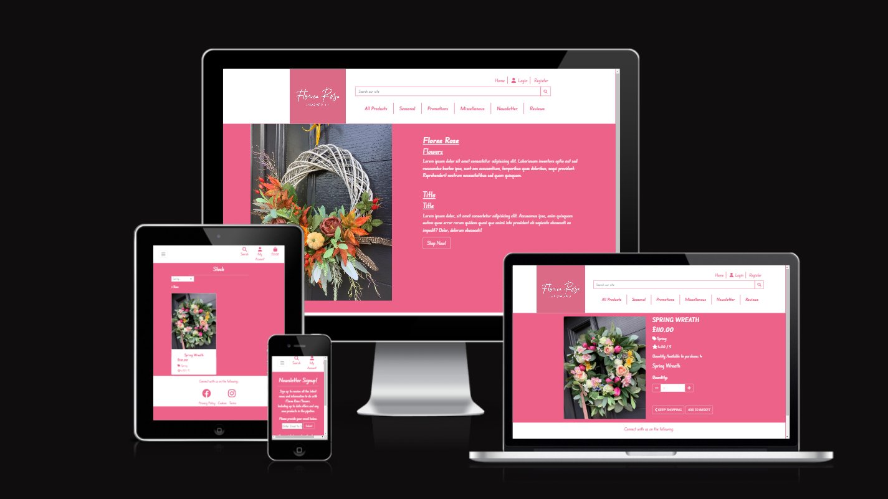

# Floree Rose Flowers

https://floree-rose.herokuapp.com/

# Purpose

## Create
Create instances of Suppliers, Ranges, Rolls and Cuts, including all relevant data that is required for each item.
## Read
Pull this information, so that the user can see the data linked to a particular item. i.e Suppliers, or Ranges that are linked 
to a particular Supplier. Also to be able to manipulate this data to bring back relevant information for the user. i.e An overall
roll balance for a particular roll.
## Update
Allow the user to update the data that has already been created. i.e Customer changes their cut size, or a Roll has been delivered short.
## Delete
Allows the user to delete data that is no longer required. i.e Rolls that have been completely sold, and all cuts have been taken from it.

# Database Schema

# Agile

# Wireframes

## Desktop Wireframe
![Desktop Wireframe]

## Mobile Wireframe
![Mobile Wireframe]

# User Responsiveness

Image of how the site will look on different platforms, from Desktop to Mobile.

# Lighthouse Performance

# Validation

# Frameworks, Libraries & Dependancies

The following packages were used to create this project.

### Django 3.2
[Python web framework](https://www.djangoproject.com/)

### Psychopg 2
[Python PostgreSQL adapater](https://pypi.org/project/psycopg2/)

### Gunicorn
[Python WSGI HTTP server](https://gunicorn.org/)

### dj-database-url
[Django utility to create an environment variable to configure the Django application](https://pypi.org/project/dj-database-url/)

### Django-allauth
[User account management django application suite](https://django-allauth.readthedocs.io/en/latest/overview.html)

### Bootstrap 4.6.2
[Front end CSS and JavaScript library](https://getbootstrap.com/)

# Features

## Future Features

# Testing

# Bugs

# Deployment

# Credits
